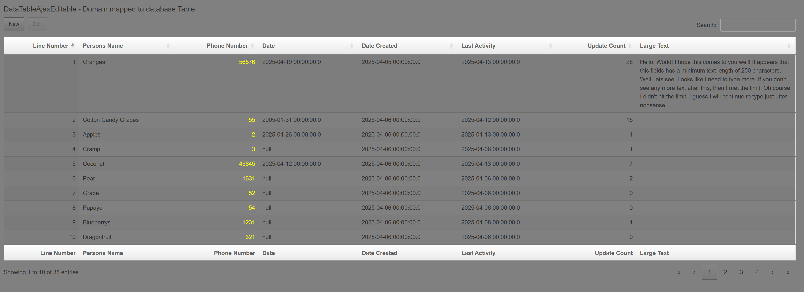
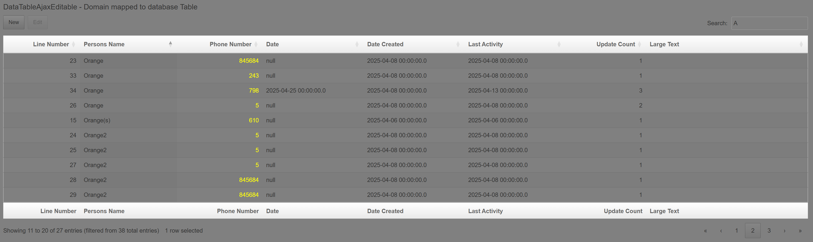
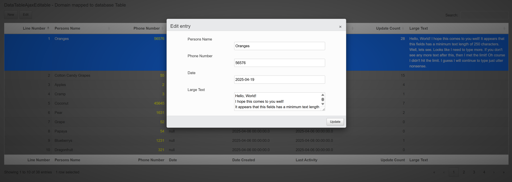
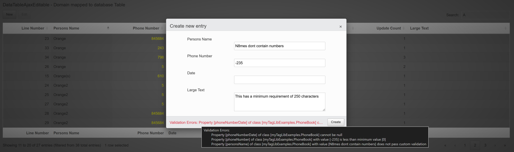
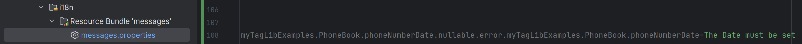
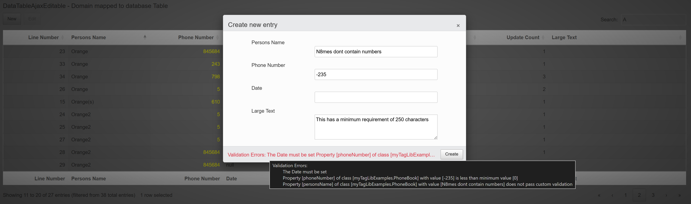

# GrailsDataTables
This is a Grails Web Plugin for the popular JavaScript library <a href='https://datatables.net/'>DataTables</a>.
 

---

<h3>I started</h3> this project started out just for fun, as a way to learn about Grails 
and maybe find a way to help speed along 
configuring and programming tables for 
webapps (grails webapps for work)

Dont worry if theres something wrong, what they had before was... Can't say. What I can say is it was only ever used for internal apps,
and I would say the same here. I take no responsibility, use this as you want.

---

<h3>It still is</h3>
just that, a project for fun. I am unsure what is a professional plugin for Grails from what I've seen. 
I do not mind any forking, do so - and I do not mind suggestions either.

---

<h2>Below is the readme from my original project. It is not updated.</h2>

---

### What is the plugin?

This plugin includes a set of until classes, a grails service and a grails taglib. That when used together, is able
to produce a natively managed DataTable within the grails application itself. The plugin serves datatables based on annotated classes, and columns come from fields that have been annotated.

For crud operations (DataTableAjaxEditable & DataTableAjax), the passed object into the data attribute of the tags needs to be a gorm-domain-class that has been annotated. Gorm hibernate is the implementation. No pure hibernate solution is available yet.

For read only operations, or for more customization/flexibility, the plugin can also serve datatables based on a list of objects whom class is the same, and annotated with WebUI datatable annotations. Full rendering capabilities are available, but no ajax/server processing outside of rendering the DataTable, alongside the collection of objects, will occure.

---

### Basic config

1. 
Include the plugin as a dependency in gradle.build:
implementation("org.tupperware:grailsDataTables:1.0.1")

2. 
Add annotations to a class. This declares the class as being able to be used with WebUI DataTable tags and the type of table (html, ajax, ajax_editable) and passes some meta-data used for configuration (e.g. whether allow editing, new, ect if its an editable ajax. This information is needed by the services and taglib to manage a DataTable. Exceptions will be thrown by services or tags if something is wrong). The example here would be for a gorm-domain-class.
@DataTable(type = DataTableType.AJAX_TABLE_EDITABLE, allowEdit = true, allowNew = true)

3. 
Add annotations to the class's fields. At minimum, fields annotated with this will at least render in the DataTable. Whether fields are editable depends on configuration. Non-editable fields do not show in the form editor, nor is the editor configured with the properties. WebUI services will ignore the field during update and inserts.
@DTColumn(name = "Persons Name", editable = true, type = DTColumnDataType.STRING, order = 1, sortable = true, ajaxColumnName = "persons_name")

4. 
Include a tag for rendering the domain as a datatable in a gsp file.
'&lt;WebUI:dataTableAjaxEditable data="${PhoneBook.class}" id="phonebook-info" url="${createLink(controller: "editor", action: "ajax_phonebook")}" wantedExports="${['copy', 'excel', 'pdf']}" selectable="true" orderable="true" pageable="true" searchable="true" scrollX="true"/&gt;'

4. 
Finally, add an action to the controller. This will be used as the api endpoint for ajax calls DataTable produces. Unlike below, I recommend moving the actual call to the service in a service dedicated to the domain/controller. If the passed sessionFactory is null, the default dataSource is used.
@Transactional("PhoneBook")
    def ajax_phonebook() {
        def data = webUIService.serviceDataTableAjaxCall(PhoneBook.class as Class, params as GrailsParameterMap, sessionFactory_PhoneBook as SessionFactory)
        render data as JSON
    }

---

## Examples

### \<WebUI:DataTableAjaxEditable>

This image shows a datatable with all features implemented so far being used. The field types of the class, along with annotations, makes for automatic formatting (e.g. java.util.Date is automatically formatted and parsed)

This DataTable has custom rendering options set. The 'Phone Number' is being used as a g.createLink to an action. Controller and action names are available to be set in annotations, but in this case, just the actionName of the DTColumnRender is set, and controller is resolved through grails conventions. The ID name is set to the field ajaxColumnName, and the value for the id is the field value. In this case, the top row resolves to a link as 'localhost:8080/editor/show/?persons_phone_number=56576'. The color yellow is coming from the DTColumnRender colorStyle.

The second image simply shows filtering on a single column, ordered and paged, and all processing is server side via ajax calls

---

### Editor

This shows an example of editing a row. The 'Large Text' is simply a String. The DTColumn dataType has been set to TEXTAREA. There is also a DTColumnRender set for the field to change the width and height (e.g. otherwise, the dimensions of the cell would make the row large. Better to scrollX than scrollY)

Here, on this second image, I clicked create (this would work the same if editing a field) and validation of the domain class has occurred, and the webUIService has returned a formatted error message. These messages come from the messages.properties file. 

---

Below is an example of using custom messages instead of the default. Messages are grabbed through messageSource, and uses most qualified name to least qualified name until an non-null message is returned. Available params are {1}=Field name, {2}=Class name, {3}=Rejected value (These are the standard parameters added to the validation map gorm returns in the FieldErrors)

The message in use:

This allows for fully customizable messages, and more importantly an easy way to implement multi-language support.

